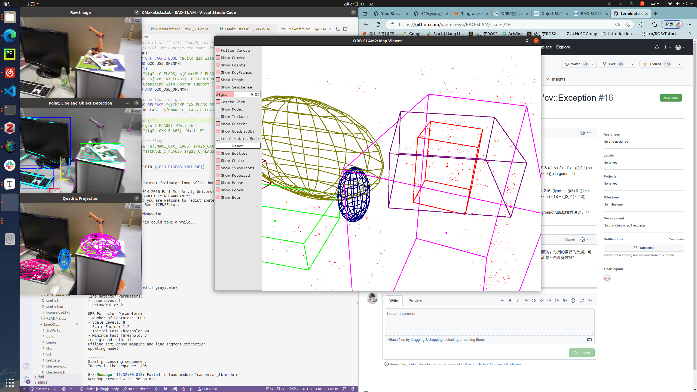

# 修改调试EAOSLAM on ubuntu20

## 编译与魔改

前言：因为EAOSLAM由CUBESLAM魔改而来，而CUBESLAM由ORB2魔改而来，所以EAOSLAM的bug是cube和orb的集大成者


运行环境：ubuntu20.04，opencv=3.4.16 pangolin=v0.5
eigen3.4.0运行会报错！！！！！！


EAO-SLAM/Thirdparty/Line3Dpp/serialization.h

添加头文件

```c++
#include <iostream>
```

EAO-SLAM/Thirdparty/Line3Dpp/line3D.cc

EAO-SLAM/Thirdparty/Line3Dpp/main_vsfm.cpp

Thirdparty/Line3Dpp/main_bundler.cpp

Thirdparty/Line3Dpp/main_colmap.cpp

Thirdparty/Line3Dpp/main_mavmap.cpp

Thirdparty/Line3Dpp/main_pix4d.cpp

添加头文件

```c++
#include<opencv2/calib3d.hpp>
#include <opencv2/imgproc/types_c.h>
#include <opencv2/opencv.hpp>
```


报错error: ‘CV_LOAD_IMAGE_GRAYSCALE’ was not declared in this scope

使用cv::IMREAD_GRAYSCALE替换全部CV_LOAD_IMAGE_GRAYSCALE


注意需要安装eigen3和pangolin

若报错

```
Pangolin could not be found because dependency Eigen3 could not be found
```

则修改find_package(Eigen3 REQUIRED)为

```cmake
find_package(Eigen3 REQUIRED NO_MODULE)
```

还需要安装cgal

```shell
sudo apt-get install libcgal-dev
apt-get install libcgal-demo
```


报错

```
/usr/include/CGAL/iterator.h:663:16: error: ‘decay_t’ in namespace ‘std’ does not name a template type
   typedef std::decay_t<typename cpp11::result_of<Op(arg_type)>::type> value_type;
```

这又是库函数的问题，其实是版本太新的兼容问题，解决方式也很简单，在cmakelist中加

```
set(CMAKE_CXX_STANDARD 14)
```


include/YOLOv3SE.h报错

```cmake
/home/bopang/Object_level_slam/EAO-SLAM/EAO-SLAM/include/YOLOv3SE.h:164:38: error: no matching function for call to ‘_IplImage::_IplImage(cv::Mat&)’
   IplImage* iplimg = new IplImage(img);
```

解决：

一眼鉴定为cv库的版本问题，解决方案为修改

/home/bopang/Object_level_slam/EAO-SLAM/EAO-SLAM/build.sh

line43-

```
cmake .. -DCMAKE_BUILD_TYPE=Release -DCMAKE_CXX_FLAGS=-DCV__ENABLE_C_API_CTORS -DPYTHON_EXECUTABLE=/usr/bin/python3 
```


ceres库报错

```shell
/usr/local/include/ceres/internal/integer_sequence_algorithm.h:67:21: error: ‘integer_sequence’ is not a member of ‘std’
```

解决，改cmakelist，加

```cmake
set(CMAKE_CXX_STANDARD 14)
```

报错

EAO-SLAM/src/detect_3d_cuboid/object_3d_util.cpp

EAO-SLAM/src/detect_3d_cuboid/box_proposal_detail

```cmake
error: ‘iota’ was not declared in this scope
```

解决：

加头文件

```c++
#include <numeric>
```


**作者勘误**

```
你可以试试将所有 CMakeLists.txt （包括第三方库）中的 -march=native 删掉，重新编译试试。
```

运行时报错：

```shell
terminate called after throwing an instance of 'cv::Exception'
  what():  OpenCV(3.4.16) /home/bopang/general_tool/opencv3/opencv-3.4.16/modules/core/src/matrix.cpp:438: error: (-215:Assertion failed) _step >= minstep in function 'Mat'
```


最后再运行./build.sh

可以成功bulid


其中ORB2和ORB系代码会报错

```shell
Gtk-Message: 11:32:00.018: Failed to load module "canberra-gtk-module"
New Map created with 156 points
段错误 (核心已转储)
```

需要运行

```shell
 sudo apt-get install libcanberra-gtk-module
```

来配一下这个库


## 运行测试

本机数据集路径/media/bopang/PBDATA/dataset/

**3.1** **Object size and orientation estimation**.

use iForest and line alignment:

```shell
./Examples/Monocular/mono_tum LineAndiForest /media/bopang/PBDATA/dataset/TUM_RGB-D/rgbd_dataset_freiburg3_long_office_household
```

only use iForest:

```shell
./Examples/Monocular/mono_tum iForest /media/bopang/PBDATA/dataset/TUM_RGB-D/rgbd_dataset_freiburg3_long_office_household
```

without iForest and line alignment:

```shell
./Examples/Monocular/mono_tum None /media/bopang/PBDATA/dataset/TUM_RGB-D/rgbd_dataset_freiburg3_long_office_household
```





**3.2** **Data association**

without data association:

```shell
./Examples/Monocular/mono_tum NA /media/bopang/PBDATA/dataset/TUM_RGB-D/rgbd_dataset_freiburg3_long_office_household
```

data association by IoU only:

```
./Examples/Monocular/mono_tum IoU /media/bopang/PBDATA/dataset/TUM_RGB-D/rgbd_dataset_freiburg3_long_office_household
```

data association by Non-Parametric-test only:

```
./Examples/Monocular/mono_tum NP /media/bopang/PBDATA/dataset/TUM_RGB-D/rgbd_dataset_freiburg3_long_office_household
```

data association by ourensemble method:

```
./Examples/Monocular/mono_tum EAO /media/bopang/PBDATA/dataset/TUM_RGB-D/rgbd_dataset_freiburg3_long_office_household
```


